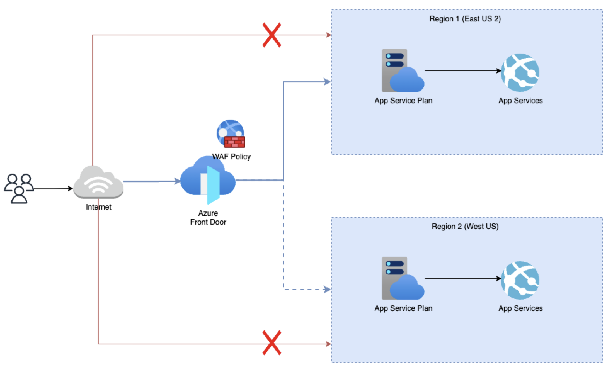

# Azure Front Door with App Services

This repository contains an Infrastructure as Code (IaC) solution to deploy Azure Front Door with App Services using Terraform. The configuration allows for the integration of multiple web applications running on Azure App Services behind an Azure Front Door instance, providing global load balancing, high availability, and security.

## Table of Contents

- [Overview](#overview)
- [Architecture](#architecture)
- [Features](#features)
- [Prerequisites](#prerequisites)
- [Setup](#setup)
  - [Clone the Repository](#clone-the-repository)
  - [Configure Environment](#configure-environment)
  - [Initialize Terraform](#initialize-terraform)
  - [Deploy the Resources](#deploy-the-resources)
  - [Verify Deployment](#verify-deployment)
- [Configuration](#configuration)
- [Contributing](#contributing)
- [License](#license)
- [Contact](#contact)

## Overview

This project demonstrates how to set up an Azure Front Door to route traffic to multiple Azure App Services. By using Azure Front Door, you can enhance your application's performance and security with features such as caching, routing rules, and web application firewall (WAF).

## Architecture

The architecture of this setup includes the following components:

- **Azure Front Door**: A globally distributed service for load balancing traffic to multiple web applications.
- **Azure App Services**: Multiple instances of Azure App Services that serve as the backend for the Azure Front Door.
- **Routing Rules**: Front Door is configured with custom routing rules to direct traffic to the appropriate App Service instance based on URL path or domain.
- **Custom Domains**: This configuration supports custom domain names for the applications.
- **Web Application Firewall (WAF)**: Protects the applications from common web-based threats.



## Features

- Global load balancing using Azure Front Door.
- Support for multiple Azure App Services.
- Custom routing rules for different applications.
- Web Application Firewall (WAF) integration for enhanced security.
- Support for HTTPS using certificates.
- Easy scalability with Terraform-based infrastructure.

## Prerequisites

To use this repository, you'll need:

- An **Azure account** with sufficient permissions to create resources.
- **Terraform** installed (version 1.0 or later).
- **Azure CLI** installed and configured.
- **Git** for cloning the repository.

## Setup

### 1. Clone the Repository

Clone this repository to your local machine:

```bash
git clone https://github.com/sihbher/AzureFrontDoor-AppServices.git
cd AzureFrontDoor-AppServices
```

### 2. Configure Environment

Ensure your Azure CLI is authenticated and your Terraform environment is initialized:

```bash
# Login to Azure
az login

# Set the subscription (if needed)
az account set --subscription "your-subscription-id"
```

### 3. Initialize Terraform

Initialize the Terraform working directory, which will download the necessary providers and modules.

```bash
terraform init
```

### 4. Deploy the Resources

To deploy the Azure Front Door and App Services, follow these steps:

1. Edit the `terraform.tfvars` file with your desired configuration values, such as resource names, regions, and other necessary variables.
   
2. Run the following Terraform commands:

```bash
# Review the changes to be applied
terraform plan

# Apply the configuration to create the resources
terraform apply
```

### 5. Verify Deployment

After the deployment completes successfully, verify the following:

- The Azure Front Door instance is created and running.
- The App Services are deployed and accessible through the Front Door endpoint.
- Routing rules are correctly set up and traffic is properly routed based on your configuration.

## Configuration

### Variables

You can configure the deployment by modifying the `variables.tf` or `terraform.tfvars` file with the following options:

| Variable Name          | Description                                                                                     | Type   | Default Value                  | Validation                                                                                   |
|------------------------|-------------------------------------------------------------------------------------------------|--------|--------------------------------|----------------------------------------------------------------------------------------------|
| `primary_location`      | The Azure region to deploy resources                                                            | string | `eastus2`                      | None                                                                                         |
| `secondary_location`    | The Azure region to deploy resources                                                            | string | `westus`                       | None                                                                                         |
| `os_type`              | The OS type for the resources                                                                    | string | `Linux`                        | None                                                                                         |
| `front_door_sku_name`   | The SKU for the Front Door profile. Possible values include: Standard_AzureFrontDoor, Premium_AzureFrontDoor | string | `Premium_AzureFrontDoor`       | Must be either `Standard_AzureFrontDoor` or `Premium_AzureFrontDoor`                          |

This table summarizes the variables used in your Terraform configuration, along with their types, default values, and any validation rules.


## Contributing

Contributions are welcome! If you have any ideas or encounter issues, feel free to submit a pull request or open an issue.

1. Fork the repository.
2. Create a new branch (`git checkout -b feature/your-feature`).
3. Make your changes and commit (`git commit -am 'Add new feature'`).
4. Push the branch (`git push origin feature/your-feature`).
5. Open a Pull Request.

## License

This project is licensed under the MIT License. See the [LICENSE](LICENSE) file for details.

## Contact

For questions or support, feel free to contact the repository owner.

- **GitHub**: [sihbher](https://github.com/sihbher)

---

Feel free to modify the `README.md` to fit any additional details or customization that are specific to your project! Let me know if you need further assistance.